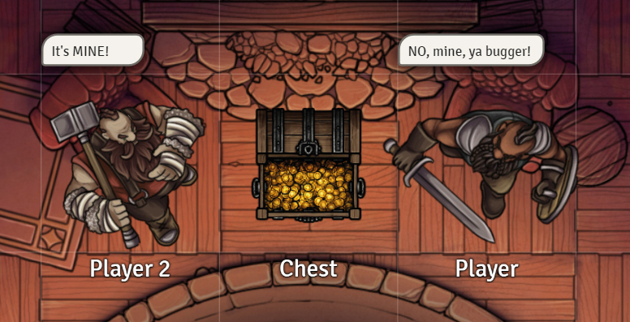
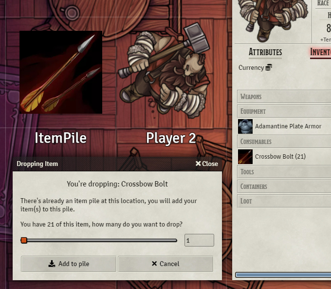
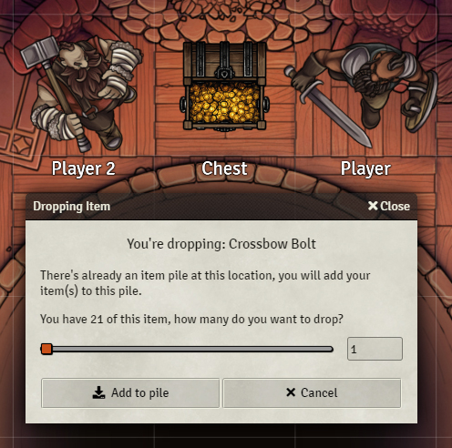
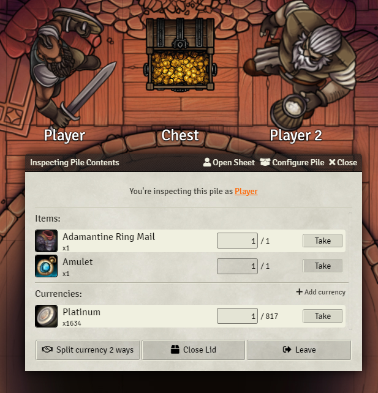
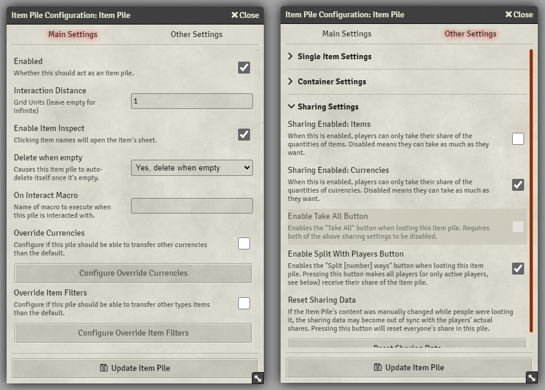
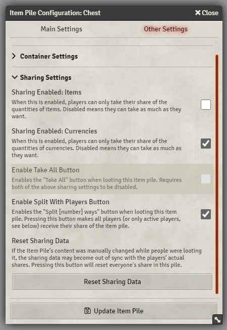
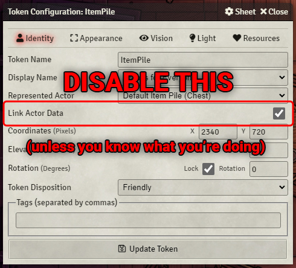
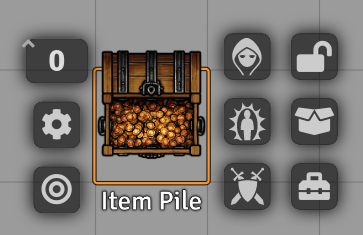
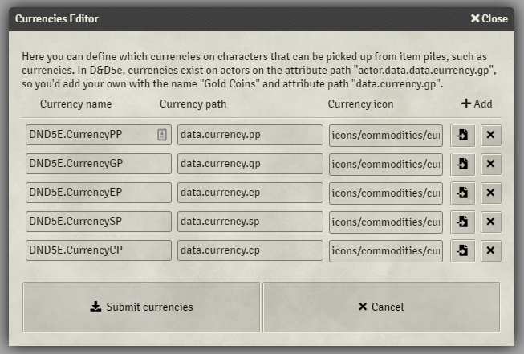

# Item Piles

 [](https://forge-vtt.com/bazaar#package=item-piles)  

---


A module made by Fantasy Computerworks.

Other works by us:
- [Fantasy Calendar](https://app.fantasy-calendar.com) - The best calendar creator and management app on the internet 
- [Sequencer](https://foundryvtt.com/packages/sequencer) - Wow your players by playing visual effects on the canvas
- [Potato Or Not](https://foundryvtt.com/packages/potato-or-not) - Automatically set up Foundry to the best visual settings for your players' potato computers 
- [Tagger](https://foundryvtt.com/packages/tagger) - Tag objects in the scene and retrieve them with a powerful API
- [Token Ease](https://foundryvtt.com/packages/token-ease) - Make your tokens _feel good_ to move around on the board

Like what we've done? Buy us a coffee!

<a href='https://ko-fi.com/H2H2LCCQ' target='_blank'></a>

---

### Chest sprites used on this page is from Forgotten Adventures*

**not included in this module*




## What is Item Piles?

Have you ever wished you could represent items in your scenes? A pile of items, something to interact with - or perhaps chests whose appearance changes depending on what happens to it, whether it's open, closed, full, or empty. Do you want an easy way to split loot between players?

Then you need **Item Piles**!

In short, this module enables dropping items onto the canvas, which then get represented as a pile of items. In order to work in all systems without breaking or messing too much with the core functionality of Foundry, this **creates an unlinked token & actor** to hold these items. When a player double-clicks on an item pile token, it opens a custom UI to show what the pile contains and players can then take items from it.

Item Piles can also be configured to act as a container, where it can be open or closed, locked or unlocked, with the ability for the token that represents the pile to change image depending on its state.

In addition, when an item pile is interacted with it can also play sounds for the action, such as opening, closing, or attempting to open a locked item pile. Sounds are only played for the user who attempted the action.

Last but not least, the module features a robust and well documented API, where module and system creators can leverage Item Piles to enrich your looting experience.

---

## Installation

It's always easiest to install modules from the in game add-on browser.

To install this module manually:
1.  Inside the Foundry "Configuration and Setup" screen, click "Add-on Modules"
2.  Click "Install Module"
3.  In the "Manifest URL" field, paste the following url:
`https://github.com/fantasycalendar/FoundryVTT-ItemPiles/releases/latest/download/module.json`
4.  Click 'Install' and wait for installation to complete
5.  Don't forget to enable the module in game using the "Manage Module" button

## Required Modules

### socketlib

This module uses the [socketlib](https://github.com/manuelVo/foundryvtt-socketlib/) library so that players can modify the contents and the look of item piles without having to have full ownership of the item piles. Without it, they could only drop items and create item piles using pile actors they own.

### libwrapper

This module uses the [libwrapper](https://github.com/ruipin/fvtt-lib-wrapper) library for wrapping core methods. It is a hard dependency, and it is recommended for the best experience and compatibility with other modules.

## Optional Modules

### Advanced Macros

This module leverages the [Advanced Macros](https://github.com/League-of-Foundry-Developers/fvtt-advanced-macros) module so that any macros can use extra data provided by the Item Piles module. This is an optional install, but highly recommended.

## Natively Supported Systems

Item Piles is designed to work in all systems, but may require some setup for it to fully function. Please refer to the module settings to configure that.

- [Dungeons & Dragons 5e](https://foundryvtt.com/packages/dnd5e)
- [Pathfinder 1e](https://foundryvtt.com/packages/pf1)
- [Dungeon Slayers 4](https://foundryvtt.com/packages/ds4)
- [D&D 3.5e SRD](https://foundryvtt.com/packages/D35E)
- [Savage Worlds Adventure Edition](https://foundryvtt.com/packages/swade)
- [Tormenta20](https://foundryvtt.com/packages/tormenta20)

## Semi-supported systems

- [Pathfinder 2e](https://foundryvtt.com/packages/pf2e) - While Item Piles _works_ in this system, item piles is not strictly needed as PF2e already has a robust loot actor & token system, and feature rich systems.

## Requesting New Systems

If you wish to request a new system, please create a new [system request here](https://github.com/fantasycalendar/FoundryVTT-ItemPiles/issues/new?assignees=Haxxer&labels=enhancement&template=system-request.md&title=%5BSYSTEM%5D+-+Write+the+system%27s+name+here).

Fill in _all_ of the information, and ask in the system's discord channel if you don't know what something means.

Incomplete requests will be rejected.

## Usage

### Interaction

Any player or GM can drag & drop items - if you drag & drop an item from an actor's inventory, you will be prompted how many of that item that you wish to drop (if they have more than 1 of the item). GMs can also drop items from the item list in the right sidebar.





Holding ALT before dragging & dropping an item will make you automatically drop 1 of the items into a new pile without a promptUser. **You can also drag and drop items onto an existing pile**, where holding ALT is also supported.

When players double-click on the item pile (or Left Control + double-click for GMs to inspect, or to inspect as someone else select two tokens, and repeat), they will get a custom UI where they can choose what they want to take from the item pile, or all of it (if they're loot goblins).



### Initial Setup

When a player or a GM drops the first item into a scene, the **default item pile actor** will be created. Do **not** delete this actor, as it is the actor and token that is used for all item drops. It's not recommended to change this actor or token styling unless you know what you're doing.

Instead, we recommend that you duplicate the default item pile to create new versions of that pile, and experiment with that. Alternatively, turn existing actors into new item piles through the `Item Pile` button on the actor sheets' header bar. This UI has a wide range of customization, which allows you to control exactly how your players interact with the item pile.




### Sharing and splitting

When you configure an item pile, you can set it up to handle splitting quantities of items and/or currencies in the item pile's configuration:



The notable settings are **Sharing Enabled: Items** and **Sharing Enabled: Currencies** - when these are enabled, players can only take their share of the given type. By default, items are "free for all" and currencies can only be split.

If there's any quantity that is uneven and cannot be split between players, there may be some left over from the split, which you will have to pick up manually.

When both sharing options are disabled, only then can you enable the **Take All** button.

### Warning!

Be sure to set any new Item Piles as **unlinked from its actor data**! Unless you know what you're doing, keeping this enabled will be confusing as **all tokens of this pile will share the same images and inventory**.



### Extra UI and settings

In addition, item piles have a few extra buttons on the right click Token HUD to open, close, lock, and unlock containers, and a quick way to access the configuration of that token.



In the module settings, you can configure all sorts of things, such as whether empty piles auto-delete once they're empty, and which item types are allowed to be picked up. These are by default configured to the D&D5e system, so adjust them accordingly for your own system.

### Currencies and attributes

For most systems, currencies or other physical things aren't considered "items" in Foundry, but rather just numbers on the sheet, so dragging and dropping them is hard. However, Item Piles still allow you to pick up such items from piles using its flexible "Dynamic Attributes" feature. With this feature, you can configure what types of these "numbers only" things that can still be picked from piles up by players.



Each row represents a field on a character sheet that may be picked up. As you can see, the D&D5e system denotes the number of gold coins a character has with the `actor.data.data.currency.gp` field, so by putting `data.currency.gp` as a valid field in this UI, Item Piles figures out that if an actor has more than 0 in this field, it can be "picked up" and transferred to the character who picked it up.

Keep in mind that the name field in here accepts localization strings, so for D&D5e's currencies, you could enter `DND5E.CurrencyGP` in the name field.

## Useful Macros

Item Piles has a powerful API, which allows you to quickly modify the item piles in your scenes.

### Turn selected tokens into item piles

```js
if(!canvas.tokens.controlled.length) return;
ItemPiles.API.turnTokensIntoItemPiles(canvas.tokens.controlled)
```

### Revert selected tokens from item piles:
```js
if(!canvas.tokens.controlled.length) return;
ItemPiles.API.revertTokensFromItemPiles(canvas.tokens.controlled)
```

## Item Piles Settings

- **Currencies:** This setting defines which currencies on characters that can be picked up from item piles, such as currencies.

- **Item filters:** Here you can configure what item types are ignored and not listed in the item pile dialogs.

- **Actor class type:** This setting defines the type of actor that will be used for the default item pile actor that is created on first item drop.
  
- **Item quantity attribute:** Here you can configure what the attribute path is for an item's quantity.

- **Auto-delete empty piles:** This causes item piles to delete themselves once they run out of items. This can be overridden on individual item piles.

- **Output to chat:** Whenever any player picks up items from an item pile, this will send a message showing what was picked up. You can choose to not send messages, send to everyone, whisper to GMs and the user that picked up the item, or just to GMs. 
  
- **Hide actor text:** This hides the "Item Piles" text in the actor header - useful if you have too many modules, and the header is getting crowded.

- **Preload Files:** Causes files (images and audio) of piles to be preloaded, resulting in a seamless experience.

- **Enable debugging:** Prints debug messages to the console.

## API, Hooks, & Documentation

### [You can find the documentation here](https://github.com/fantasycalendar/FoundryVTT-ItemPiles/wiki)

## Issues

Any issues, bugs, or feature requests are always welcome to be reported directly to the [Issue Tracker](https://github.com/fantasycalendar/FoundryVTT-ItemPiles/issues), or using the [Bug Reporter Module](https://foundryvtt.com/packages/bug-reporter/).

## [Changelog](./changelog.md)

## License

This package is under an [MIT](LICENSE) and the [Foundry Virtual Tabletop Limited License Agreement for module development](https://foundryvtt.com/article/license/).

## Credits:

- Padhiver#1916 for the French localization
- STB#9841 for the German localization
- Brother Sharp#6921 for the Japanese localization
- Forgotten Adventures for their amazing chest sprites (not included in the module)
- Caeora for their great maps and tokens (not included in this module)